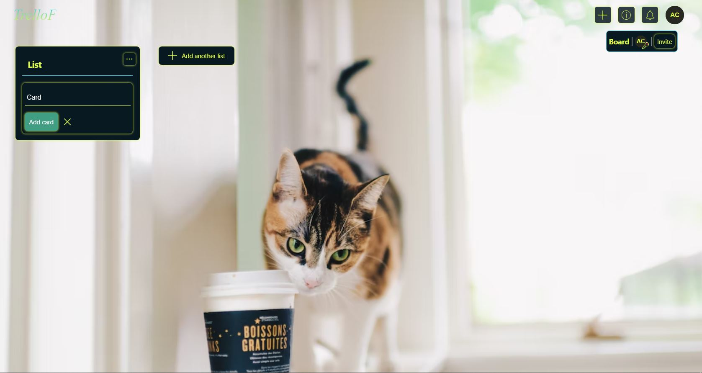

## trello-f

> Task manager that is deployed at [link](https://trello-46.herokuapp.com/)

## About

# The project provides you to get login/signup with username/password or with google

# The profile provides you to create/join boards

- Create board require name of the board and background.
  - Background could be picked up from default values or from color picker
    
  - Background could be picked up from clipboard if there is a url to picture from [unsplash](https://unsplash.com/) (needs the browser premission of using data from clipboard being set to true)
    
- Boards display at the home page.
  
  - Board could has lists that could be added via form
    
    
    
  - Lists could contain cards that could be added via card form
    
    
  - List could be removed
    
  - Card could be removed or edited
    
- User can invite another user to board
  
  - Invited user should accept the invitation
    
    
  - Then ivnited user has access to the board/lits/cards etc
    
    
